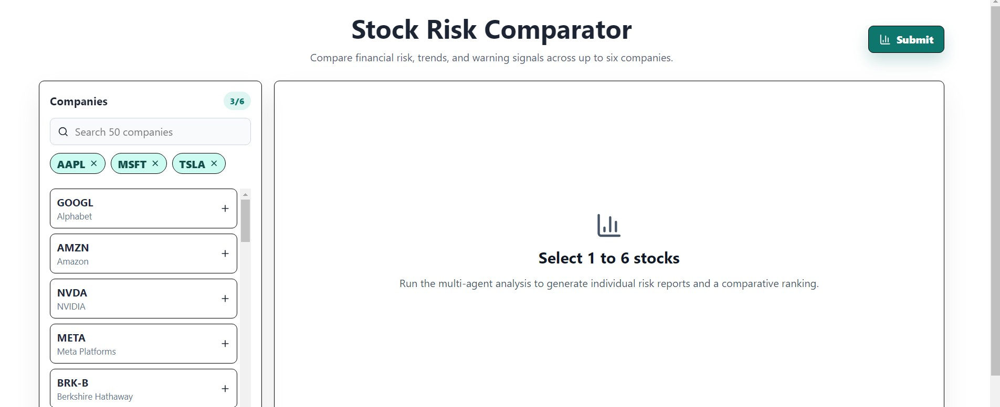
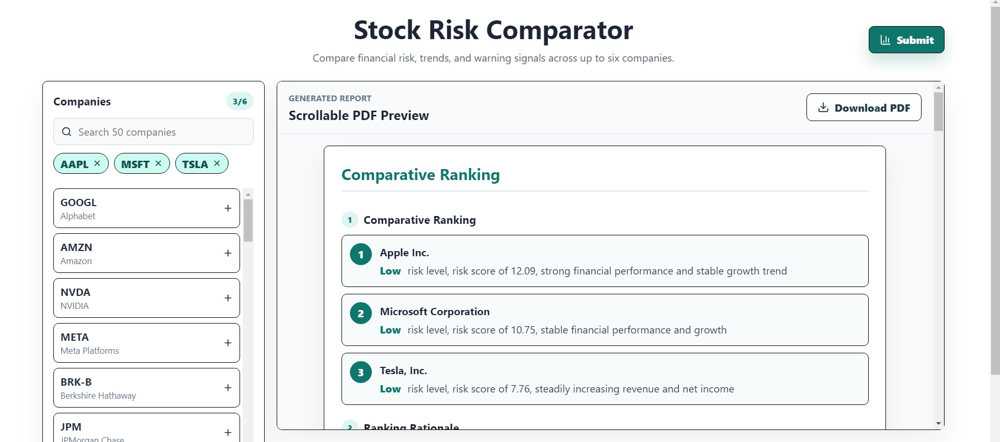
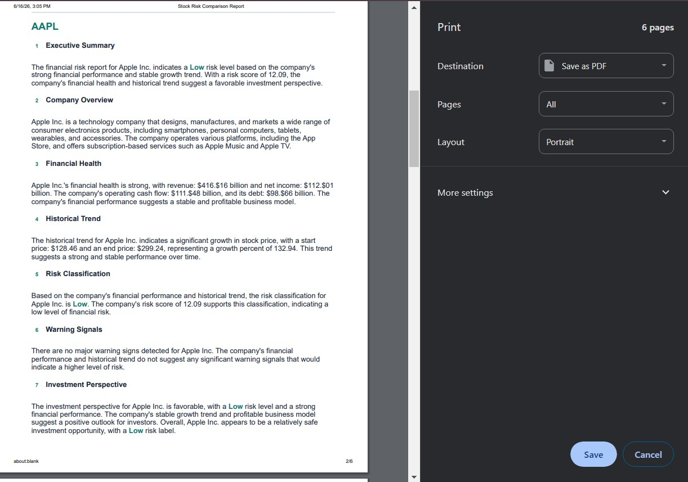

# Stock Risk Comparator

A full-stack stock comparison app that helps investors compare, rank, and export risk analysis for up to six selected companies from a list of fifty.

## Project Goal

The goal of this project is to provide a simple, interactive tool for users to compare companies by risk and financial health using market data and AI-assisted analysis, then export the results into a shareable PDF.

## Tools Used

- **Python**: backend implementation and data processing.
- **FastAPI**: backend web API framework.
- **Uvicorn**: ASGI server for serving the FastAPI backend.
- **Pydantic**: request validation and data modeling in the API.
- **yfinance**: financial data retrieval for stock metrics and trends.
- **LangChain**: AI-assisted prompt handling and report generation.
- **React**: frontend UI framework.
- **Vite**: frontend build and development tooling.
- **lucide-react**: icon library used in the UI.

## User Interface Preview

1. **Initial UI**: The first screenshot shows the main stock selection interface where the user picks tickers and starts a comparison.



2. **Stock Ranking**: The second screenshot shows the comparison output, where selected stocks are ranked and scored side-by-side.



3. **PDF Export**: The third screenshot shows how the comparison results can be converted into a PDF.



## How to Run

### Backend

```powershell
cd backend
python -m venv .venv
.\.venv\Scripts\Activate.ps1
pip install -r requirements.txt
$env:GROQ_API_KEY = "your_groq_key"
uvicorn main:app --reload --host 0.0.0.0 --port 8000
```

### Frontend

```powershell
cd frontend
npm install
npm run dev -- --host 0.0.0.0 --port 5173
```

Open `http://localhost:5173`.

## Usage Steps

1. Start the backend server using the commands above.
2. Start the frontend development server.
3. Open the app in your browser at `http://localhost:5173`.
4. Select 1 to 6 unique stock tickers from the picker.
5. Submit the comparison request.
6. Review the ranked result output and risk analysis.
7. Export the comparison report to PDF if needed.

The API validates that users choose 1 to 6 unique tickers from `backend/stocks.py`.
